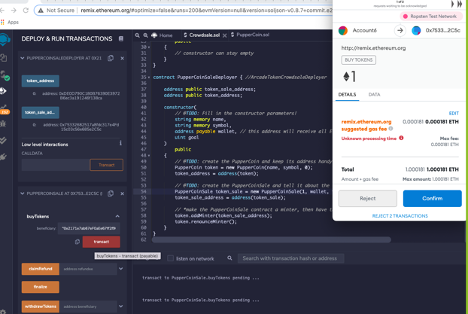

# Unit 21: You sure can attract a crowd! 

The objective is to crowdsale PupperCoin token for fundraising. This requires creating an ERC20 token that will be minted through a Crowdsale contract, leveraged from the OpenZeppelin Solidity library.  This crowdsale contract will manage the entire process, allowing users to send ETH and get back PUP (PupperCoin). This contract will mint the tokens automatically and distribute them to buyers in one transaction.

files: Crowedsale.sol and PupperCoin.sol
Wallet: MetaMask/Account 1 and Account 6
Envivronment: Injected Web3
Network: Ropsten

First we run PupperCoinSaleDeployer by choosing Account1 in metmask and the following values:

We see the contract has been deployed and we see the token_address and token_sales_address populated:

We then take the “sale_token_address” and put in the “At Address” and changes the contract to Crowdsale.sol

And validate that contract has been deployed:

Next we take the token address and place it in “At Address” and change the contract to “puppercoin.sol”:

Validate the contract has been deployed:

Next we select Account 6 from Metamask to and put its address to “buy tokens”  and select one Ether to be transferred:

We observe that the function is working as it’s pending 

We also notice the balance drop in Account 6 (original balance was 2eth)

We see the balance is reflected 

We check https://ropsten.etherscan.io/ and see the transaction 

We could also see the transaction b/w contract (account 1) and account 6, proving that code worked.

However, the transaction didn’t seem to be reflected in MetaMask when checking Account1, pls note that I spoke to TA’s and advised me it could be due to the closing being hardcoded, awaiting closing of auction in order for it to be reflected. They also advised above would be sufficient to show code is working:

